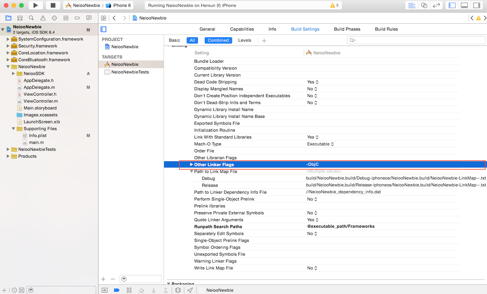
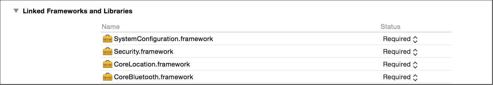
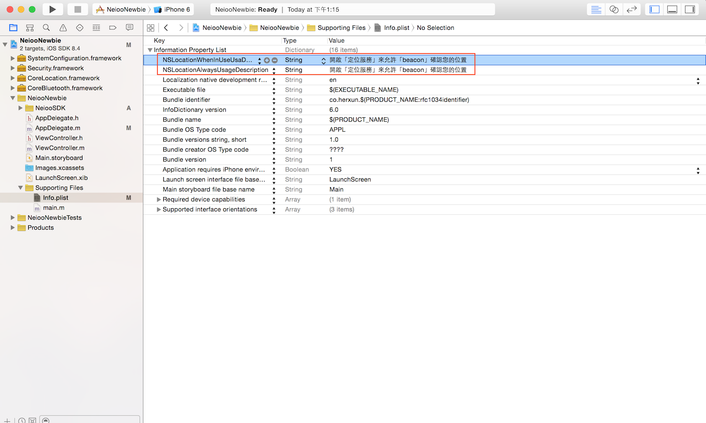
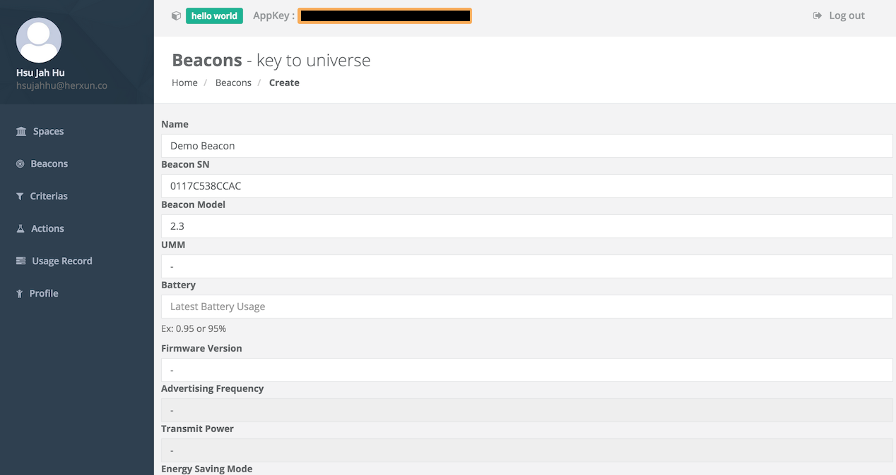
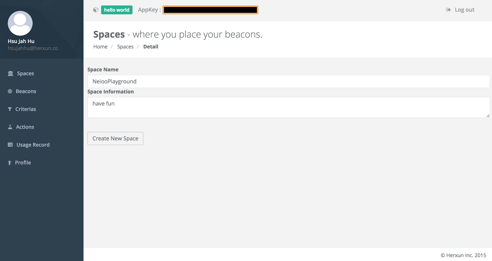
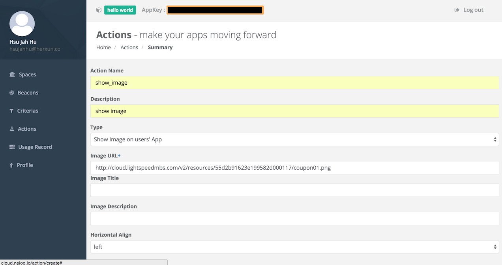
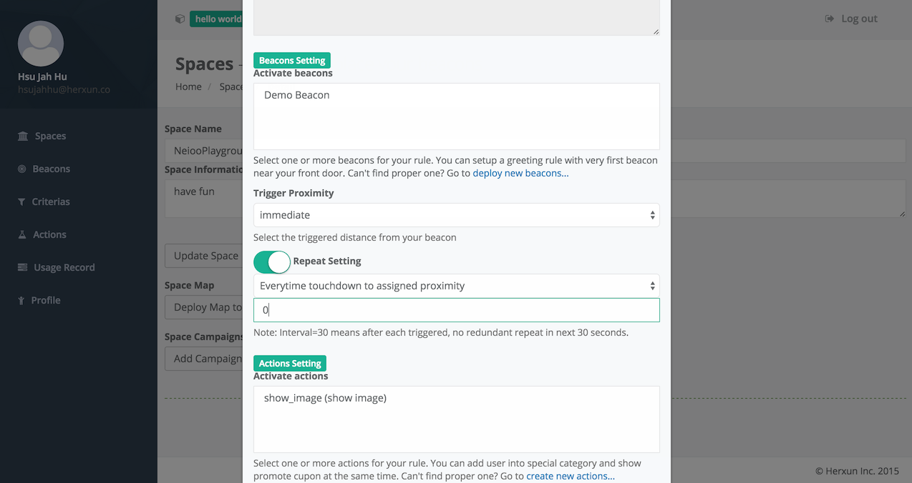
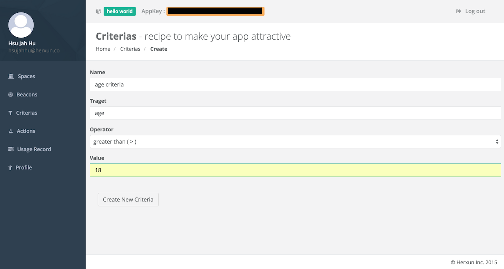
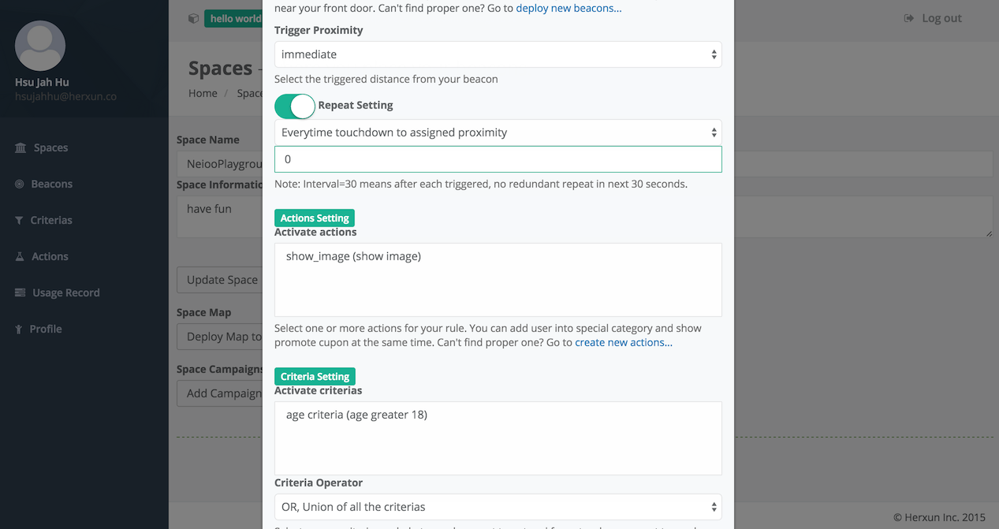
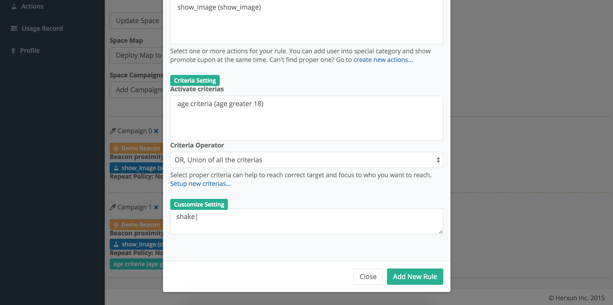

# Getting Started - iOS
### Install SDK
##### 1. Add Neioo Library Files

Unarchive the downloaded files and then move all files under ‘Headers’ directory plus the libNeiooSDK-* .a and SensoroBeaconKit file to your Xcode project.


##### 2. Change Project Settings
For the sake that there is 'Category' included in the SDK, ' -ObjC' should be added into 'Other Linker Flags'
```
Targets --> Build Settings --> Linking --> Other Linker Flags
```


##### 3. Import Framework

- CoreBluetooth.framework
- CoreLocation.framework
- Security.framework
- SystemConfiguration.framework



##### 4. Edit info.plist File
In iOS 8, the notification content is required. When calling the function, the system will push this paragraph of text to the user if he/she has not authorize the App to use the location service. You may need to add the following key to Info.plist:
```
NSLocationAlwaysUsagDescription or NSLocationWhenInUseUsaDescription
```
Add your App's description of using location services, like example:
```
ex. We need your location for detecting beacon.
```
Note that if the user doesn't allow location services to be enabled for your app, the app will not be receiving any beacon signals.



### Project Initialization Setting
##### 1. Import Neioo
In order to facilitate implementations. Please import Neioo to `AppDelegate.m`
``` objective-c
#import @"Neioo.h"
```
##### 2. Initialize Neioo
Neioo must be started only after initialization. If the user doesn't complete initialization before using Neioo, then it will throw the NeiooException to remind you to complete this step.

``` objective-c
#import "AppDelegate.h"
#import "Neioo.h"
// 1. Setup Neioo delegate
@interface AppDelegate ()<NeiooDelegate>
@end

@implementation AppDelegate

- (BOOL)application:(UIApplication *)application didFinishLaunchingWithOptions:(NSDictionary *)launchOptions {
   // 2. Initialize Neioo
    [Neioo setUpAppKey:@"YOUR APP KEY" delegate:self withLocationAuthorization:NeiooLocationAuthorizationAlways];
   // 3. start Neioo
    [[Neioo shared] enable];
    return YES;
}
```
There are two location authorization mode you can choose, and it will correspond to your description of location service which you set in info.plist.

``` objective-c
#import "Neioo.h"
typedef enum {
      NeiooLocationAuthorizationWhenInUse,
      NeiooLocationAuthorizationAlways
   } NeiooLocationAuthorizationType;
...
```
### Neioo Cloud Settings
##### 1. Create Beacon
 The most important thing of using Neioo is that you must have a Neioo Beacon, and create or upload it's information to Neioo Cloud. There are two ways for creating as shown below:

- Manually create
- Upload by Neioo Officer




##### 2. Create Space
After the establishment of beacon, you also need a space to deploy beacon. This space may be an event hall,  shopping malls or whatever. Please see the step as shown below :  


##### 3. Create Action
Once you have completed the first two steps, this time, you'll need the action to trigger some surprise when user encounters beacon. This action may be displaying a coupon icon on the phone, playing a commercial video , showing a product web site. Please see the step as shown below :


***
### Implementation: Basic Event Trigger
If you have completed the initial Neioo Cloud setting, we can have a simple demo shown how to combined the Neioo SDK with Neioo Cloud .
##### 1. Create Triggered Campaign
Please do not impatient for previous step, all of the steps are in order to produce the reusable material for demo. Now that we need to build the campaign which contains a lot of trigger-related settings, such as how often the campaign triggered, start time and end time of campaign, the range of triggered. Please see the step as shown below :



##### 2. Implementation: Space Delegate Function
This method is mainly used to detect that a user enters / leaves space. When the user enters the region of space which is determined by signal of beacons, the following methods will be triggered by Neioo：
``` objective-c
- (void)neioo:(Neioo *)neioo didEnterSpace:(NeiooSpace *)space
{
    NSLog(@"Enter Space!!!");
}
```
When the user leaves beacon deployment range, the following methods will trigger by Neioo：
``` objective-c
- (void)neioo:(Neioo *)neioo didLeaveSpace:(NeiooSpace *)space
{
    NSLog(@"Leave Space!!!");
}
```
##### 3. Implementation: Campaign Triggered Delegate Function
When the campaign is triggered, the method will be called and return with campaign. In Neioo SDK, campaign is packaged as `NeiooCampaign` object, which contains the settings of ​​Neioo Cloud and beacon corresponding object is `NeiooBeacon`, which contains information of beacon in Neioo Cloud. Now that we can use the action we already set up as an example：
``` objective-c
- (void)campaignTriggered:(NeiooCampaign *)campaign beacon:(NeiooBeacon *)beacon
{
    for (NeiooAction *action in campaign.actions){
        // ex.
        if ([action.type isEqualToString:@"show_image"]){
            // show image
            NSLog(@"Trigger action!!!!!, action type: %@",action.type);
        }
    }
}
```
##### 4. Testing Result
When you move the phone close to the beacon with campaign, campaign will be triggered by Neioo. In this example, we set the trigger range (proximity) to `Immediate`, which equivalent to about 50 cm from beacon. In order to see the log in Xcode, you can also move beacon close to your phone for testing, or add some UI as a reminder .
***

### Implementation: Conditional Event Trigger
This demo is similar to the aforementioned implementations, the only difference is that we need to build the criteria for conditional campaign triggered. We can target certain users to trigger this campaign, let us follow the steps to get started it !

##### 1. Create Criteria
We need to create a criteria for campaign, and you can define the target value of criteria by yourself. In this example, we use the user's `age` as target value. Then campaign will be triggered when user's `age is greater than 18`. Please see the step as shown below :


##### 2. Create Triggered Campaign
Now that we create a campaign with criteria, and other settings can be consistent with the previous demo . Please see the step as shown below :


##### 3. Import User's Data to Neioo
``` objective-c
...
- (BOOL)application:(UIApplication *)application didFinishLaunchingWithOptions:(NSDictionary *)launchOptions {
    [Neioo setUpAppKey:@"YOUR APP KEY" delegate:self withLocationAuthorization:NeiooLocationAuthorizationAlways];
    //  Set up user age
    [[Neioo shared] setCriteriaData:@"19" forKey:@"age"];
    [[Neioo shared] enable];
    return YES;
}
...
```
##### 4. Testing Result
You can set the user's age `> 18` or `< 18` to verify whether the results are correct. In this example, we set the criteria `age > 18`. Then, campaign will be triggered when user's age is greater than 18.  
***
### Implementation: Shaking

This demo is more complex, since the detection of shaking event must be listened by a `View` or `window` in iOS. Then, we'll show you how to quickly implement a shaking campaign  with Neioo.

##### 1. Create Triggered Campaign
This demo is similar to the aforementioned implementations, the only difference is that we need to set the `shake|` tag in campaign's `customize setting`. Please see the image as shown below :



##### 2. Implementation: Shake Range Delegate Function
This delegate will notify you if user is inside/outside the shake campaign range. You can show some UI to inform the user to shake his/her phone.
``` objective-c
- (void)inShakeRangeWithCampaign:(NeiooCampaign *)campaign
{
    NSLog(@"In shake range ...");
}

- (void)outOfShakeRangeWithCampaign:(NeiooCampaign *)campaign
{
    NSLog(@"Out of shake range ...");
}
```
##### 3. Implementation: Motion Detection and Execute Shake Campaign
Firstly, add `CoreMotion.framework` to your project and import `Neioo.h`, `<CoreMotion/CoreMotion.h>` to `viewController.m`. When you received the shake signal, you can execute the campaign which is criteria matched. Here is the step by step :
``` objective-c
#import "ViewController.h"
#import "Neioo.h"
#import <CoreMotion/CoreMotion.h>

@interface ViewController ()
@end
@implementation ViewController

- (BOOL)canBecomeFirstResponder {
    return YES;
}

- (void)viewDidAppear:(BOOL)animated {
    [self becomeFirstResponder];
}

-(void)motionBegan:(UIEventSubtype)motion withEvent:(UIEvent *)event
{
    if (motion == UIEventSubtypeMotionShake)
    {
        // shaking has began.
        NSLog(@"SHAKE BEGIN");
    }
}

-(void)motionEnded:(UIEventSubtype)motion withEvent:(UIEvent *)event
{
    if (motion == UIEventSubtypeMotionShake)
    {
        // shaking has ended
        NSLog(@"SHAKE ENDED");
        // show shake campaign
        NSArray *campaigns = [[Neioo shared]getShakeCampaigns];

        for (NeiooCampaign *campaign in campaigns){
            for (NeiooAction *action in campaign.actions){
                NSLog(@"Shake campaign triggered \n %@",[action.actionDetail description]);
            }
        }
    }
}
```
##### 4. Testing Result
The campaign will only be triggered when user is shaking their phone in range. But when user is shaking their phone outside the range, Xcode will only show the log of shaking.
