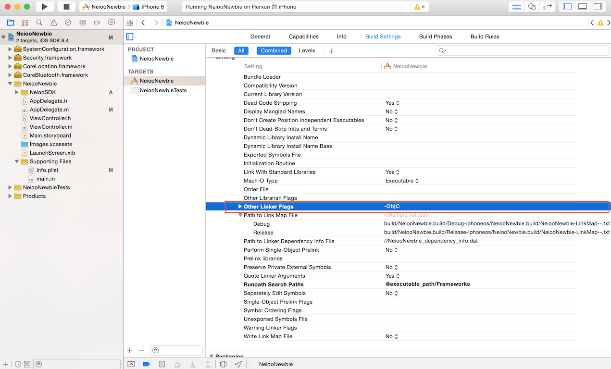
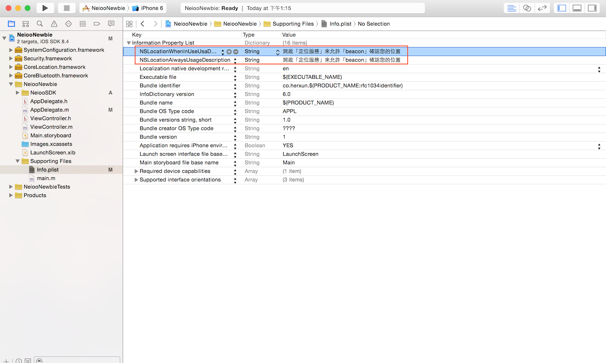
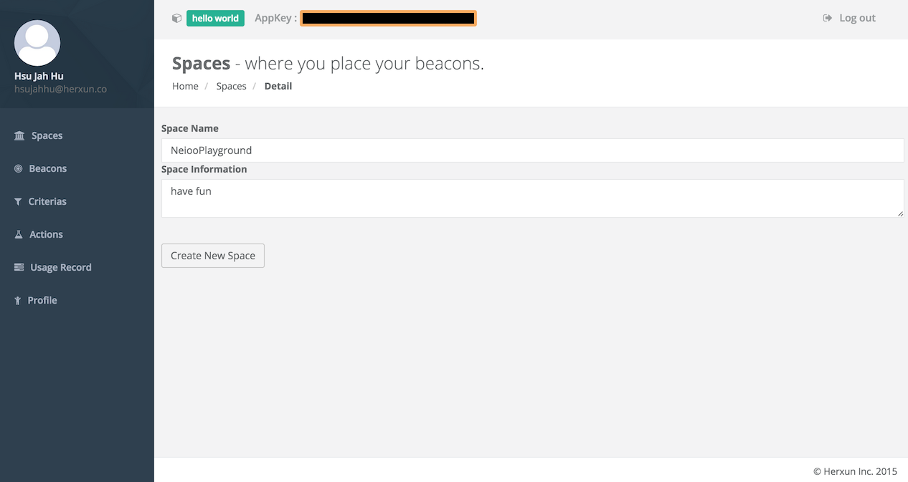
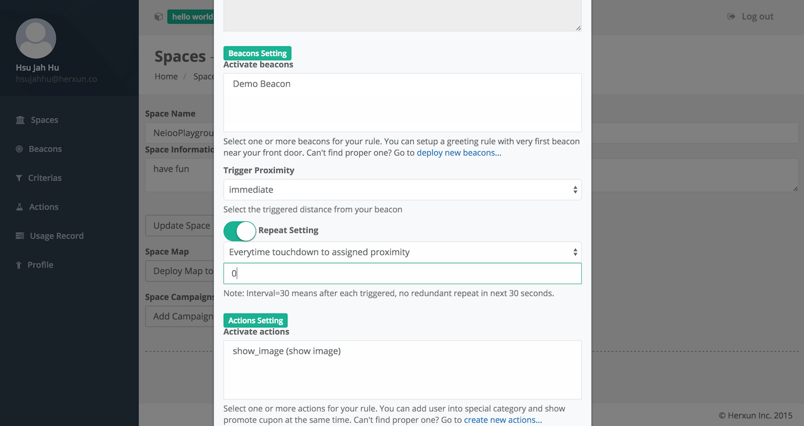

# 開始使用 - iOS
### SDK 安裝
##### 1. 加入 Neioo Library

解壓縮下載的檔案，並將 libNeiooSDK.a、sensoroKit 以及 Headers 目錄中所有文件加入您的 Xcode project 中


##### 2. 環境設定
因為 SDK 中 有包含 Category，所以需要在 Xcode project Build Settings 中的 Other Linker Flags 增加 ‘-ObjC’
至 Targets → Build Settings → Other Linker Flags


##### 3. 新增 Framework

- CoreBluetooth.framework
- CoreLocation.framework
- Security.framework
- SystemConfiguration.framework


##### 4. 更改 info.plist 檔
因為 iOS 8開始，只要使用到定位，就必須現在 info.plist中設置提示文字，否則就不會主動詢問使用者開啟定位服務。
```
NSLocationAlwaysUsagDescription or NSLocationWhenInUseUsaDescription
```
並加入對應的提示文字
```
加入 app 使用 location services 的描述
ex. 開啟「定位服務」來允許「beacon」確認您的位置
```
注意* 如果使用者不允許 app 使用 location services ， app 將不會收到任何 beacon 訊號



### Project 初始化設定
##### 1. 匯入Neioo
您可將Neioo 匯入至`AppDelegate.m`方便接下來的實作
``` objective-c
#import @"Neioo.h"
```
##### 2. 設定Neioo 初始化
Neioo 必須要初始化後才能開始使用，若沒完成初始化的步驟而直接使用Neioo，此時將會throw NeiooException，提醒您完成這步驟
``` objective-c
#import "AppDelegate.h"
#import "Neioo.h"
// 1. Setup Neioo delegate
@interface AppDelegate ()<NeiooDelegate>
@end

@implementation AppDelegate

- (BOOL)application:(UIApplication *)application didFinishLaunchingWithOptions:(NSDictionary *)launchOptions {
   // 2. Initialize Neioo
    [Neioo setUpAppKey:@"YOUR APP KEY" delegate:self withLocationAuthorization:NeiooLocationAuthorizationAlways];
   // 3. start Neioo
    [[Neioo shared] enable];
    return YES;
}
```
location authorization mode 有兩種可以選擇，這會對應到你 info.plist所設定的提示訊息
``` objective-c
#import "Neioo.h"
typedef enum {
      NeiooLocationAuthorizationWhenInUse,
      NeiooLocationAuthorizationAlways
   } NeiooLocationAuthorizationType;
...
```
### Neioo Cloud 初始化設定
##### 1. 建立Beacon
要使用Neioo，一開始最重要的是你要有一顆Neioo Beacon，並且將它建立在Neioo Cloud，而建立的方法有兩種：

- 手動建立
- 利用Neioo Officer匯入


##### 2. 建立Space
建立完Beacon後，你還需要一個beacon 所要部署的space，這個space可能是一個活動會場、可能是一個商場等。建立的方法如下圖：


##### 3. 建立Action
當你前面兩個步驟都完成後，這時候你就需要一個你希望user遇到beacon時，所需要觸發的一個動作，這動作可能是在手機顯示一張折價券圖示、播放一個廣告影片、開啟一個產品的網頁等。建立的方法如下圖：


***
### 實作基本事件觸發
假如您都完成了Neioo Cloud初始化設定，我們就可以開始實作一個簡單的demo，將Neioo SDK 與Neioo Cloud做串接。
##### 1. 建立觸發Campaign
前面Neioo Cloud初始化設定，雖然已經建立幾項物件，先別不耐煩，前面的動作都是在產生積木，後面的操作上都是可以重複使用的，現在我們要建立的是一個Campaign，裡面會包含許多觸發相關的設定，例如多久重複觸發一次、開始至結束的時間、觸發的範圍等。建立的方法如下圖：



##### 2. 實現進出 Space Delegate function
此方法主要是用來偵測使用者進出Space的事件，當使用者進入您所部署的beacon範圍內時，會觸發下列方法：
``` objective-c
- (void)neioo:(Neioo *)neioo didEnterSpace:(NeiooSpace *)space
{
    NSLog(@"Enter Space!!!");
}
```
當使用者從 Space要離開時，此刻則會觸發下列方法：
``` objective-c
- (void)neioo:(Neioo *)neioo didLeaveSpace:(NeiooSpace *)space
{
    NSLog(@"Leave Space!!!");
}
```
##### 3. 實現 Campaign Triggered Delegate function
此方法主是用來接收使用者所觸發的Campaign，以及觸發Campaign所對應的beacon，其中Campaign在SDK封裝為`NeiooCampaign`物件，裡面包含了Neioo Cloud所設定的數值，而Beacon對應的物件為`NeiooBeacon`，裡面包含了Neioo Cloud所記錄的beacon 資訊。
此範例我們以先前所設置好的Action為例：
``` objective-c
- (void)campaignTriggered:(NeiooCampaign *)campaign beacon:(NeiooBeacon *)beacon
{
    for (NeiooAction *action in campaign.actions){
        // ex.
        if ([action.type isEqualToString:@"show_image"]){
            // show image
            NSLog(@"Trigger action!!!!!, action type: %@",action.type);
        }
    }
}
```
##### 4. 測試結果
當您將手機移靠近beacon，移動至Campaign所設定的範圍後，將觸發你為 Campaign所設置的 Action，此範例設置為 Immediate，相當於距離beacon大約在50公分內視為範圍內，而為了看 Xcode中所顯示的 log也可將 beacon移動靠近手機做測試，或是自行添加 UI作為提示。
***

### 實作條件事件觸發
此 Demo與前述實作有點類似，差別在於建立Campaign時，我們可以新增一個事先設置好的Criteria來當觸發條件，我們可以限制只要讓某些特定使用者觸發此事件，讓我們按照下面步驟開始吧！

##### 1. 建立觸發Criteria
為此範例建立一個觸發條件，條件的目標值可自行定義，只要手機端與Neioo Cloud 一致即可，我們用使用者年紀`age`當作觸發條件為例，當使用者年紀大於`>`18才會觸發此事件。建立的方法如下圖：


##### 2. 建立觸發Campaign
我們在建立 Campaign時，選擇事先建立的Criteria，而其他設定與前一個 Demo一致即可。建立的方法如下圖：


##### 3. 匯入使用者資料至Neioo
``` objective-c
...
- (BOOL)application:(UIApplication *)application didFinishLaunchingWithOptions:(NSDictionary *)launchOptions {
    [Neioo setUpAppKey:@"YOUR APP KEY" delegate:self withLocationAuthorization:NeiooLocationAuthorizationAlways];
    //  Set up user age
    [[Neioo shared] setCriteriaData:@"19" forKey:@"age"];
    [[Neioo shared] enable];
    return YES;
}
...
```
##### 4. 測試結果
您可以將 age設定為大於18或是小於18驗證是否有正確的結果，此範例 Campaign中的 Criteria設定為 age大於18才會觸發事件，因此正常情況下將使用者的 age大於18時，結果會與先前沒設置 Criteria的 Demo一致，而 age小於18時，結果則相反。
***
### 實作搖一搖觸發

此示範較為複雜，由於iOS偵測搖動必須由一個`View`來listen，或是用window來偵測，比較無法直接從系統層直接偵測，iOS沒有開放這樣的API做使用，以下我們將介紹如何快速實現手機與Neioo串接達到搖一搖的功能。

##### 1. 建立觸發Campaign
此範例 Campaign設定與基本觸發一樣即可，但要特別在Customize setting中做設定，`shake|`提示為搖一搖事件，
設定方法如下：


##### 2. 實現進出搖一搖範圍偵測方法
當使用者進入 Campaign所設定範圍，會觸發 delegate function提示使用者，在這個範圍內可以搖一搖手機來觸發事件。
``` objective-c
- (void)inShakeRangeWithCampaign:(NeiooCampaign *)campaign
{
    NSLog(@"In shake range ...");
}
```
當使用者離開範圍時，則要提示使用者已離開搖一搖範圍。
``` objective-c
- (void)outOfShakeRangeWithCampaign:(NeiooCampaign *)campaign
{
    NSLog(@"Out of shake range ...");
}
```
##### 3. 實現搖一搖 Motion Detection
加入CoreMotion.framework至Project，在`viewController.m`匯入`Neioo.h`、`<CoreMotion/CoreMotion.h>`，當搖動完成後，可利用`getShakeCampaigns`取得搖一搖所要觸發的事件與動作，實現方法如下：
``` objective-c
#import "ViewController.h"
#import "Neioo.h"
#import <CoreMotion/CoreMotion.h>

@interface ViewController ()
@end
@implementation ViewController

- (BOOL)canBecomeFirstResponder {
    return YES;
}

- (void)viewDidAppear:(BOOL)animated {
    [self becomeFirstResponder];
}

-(void)motionBegan:(UIEventSubtype)motion withEvent:(UIEvent *)event
{
    if (motion == UIEventSubtypeMotionShake)
    {
        // shaking has began.
        NSLog(@"SHAKE BEGIN");
    }
}

-(void)motionEnded:(UIEventSubtype)motion withEvent:(UIEvent *)event
{
    if (motion == UIEventSubtypeMotionShake)
    {
        // shaking has ended
        NSLog(@"SHAKE ENDED");
        // show shake campaign
        NSArray *campaigns = [[Neioo shared]getShakeCampaigns];

        for (NeiooCampaign *campaign in campaigns){
            for (NeiooAction *action in campaign.actions){
                NSLog(@"Shake campaign triggered \n %@",[action.actionDetail description]);
            }
        }
    }
}
```
##### 4. 測試結果
當使用者尚未進入，搖一搖的範圍時，搖動手機雖然會有搖動的 log，但是並不會出發事件，而當使用者進入搖一搖範圍後，搖動手機則會觸發此範圍所屬的事件。
